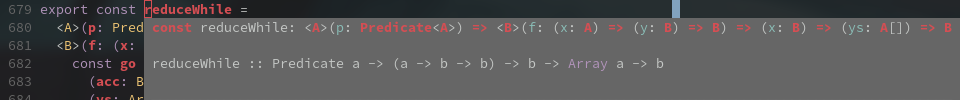

# typescript-tshm-plugin

Augment TypeScript with [tshm](https://github.com/samhh/tshm) type signatures.

The plugin is in its infancy, supporting only certain constructs such as variable and function declarations but nothing more fine-grained. It renders tshm's output alongside the normal type signature in "quick info".



## Usage

First and foremost, tshm must be installed and accessible to the plugin in your `$PATH`.

There are then two options for usage:

### Global

If your editor supports it you can load the plugin within [typescript-language-server](https://github.com/theia-ide/typescript-language-server/) (nota bene this is _not_ plain tsserver which is what ships with VSCode for "Intellisense").

1. Install the plugin globally with a package manager such as npm (`npm i -g typescript-tshm-plugin`).
2. Configure the language server to load the plugin. Here's what that might look like with Neovim's native LSP client and [nvim-lspconfig](https://github.com/neovim/nvim-lspconfig):

```lua
require'lspconfig'.tsserver.setup {
  init_options = {
    plugins = { {
      name = "typescript-tshm-plugin",
      location = "/usr/lib/node_modules/typescript-tshm-plugin/"
    } }
  }
}
```

### Project

Alternatively you can set up the plugin on a per-project basis. This will work for the likes of VSCode.

1. Install the plugin either globally or locally in your project with npm, Yarn, or similar.
2. Add the following snippet to your project's `tsconfig.json`:

```json
{
  "compilerOptions": {
    "plugins": [{ "name": "typescript-tshm-plugin" }]
  }
}
```

If your editor/language client is already running you'll need to reload it.
